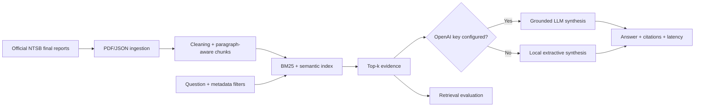

# AeroEvidence — Aviation Safety Research Assistant

[](https://github.com/thaniparthishreya/aeroevidence-aviation-rag/actions/workflows/ci.yml)


A citation-first Retrieval-Augmented Generation system for researching official NTSB aviation
investigation reports. AeroEvidence combines hybrid search, structured filters, grounded generation,
evaluation, and latency instrumentation in a reproducible Python application.

> **Independent project.** This portfolio project is not affiliated with or endorsed by the NTSB,
> FAA, or any employer. It is a research interface—not operational, legal, or safety advice.

## Product capabilities

- Ingests PDF, JSON, Markdown, and plain-text documents
- Cleans and chunks long technical reports using paragraph boundaries
- Combines BM25 lexical matching with deterministic hashed semantic vectors
- Filters by aircraft category, weather, event date, report status, and other metadata
- Produces citation-labelled answers and inspectable evidence excerpts
- Links every result back to the authoritative NTSB report
- Abstains when the indexed evidence does not support a question
- Reports retrieval and generation latency separately
- Exposes both a Streamlit product interface and FastAPI service
- Evaluates Recall@K, Mean Reciprocal Rank, filters, citations, and abstention

## Architecture



## Verified results

The bundled benchmark uses eight evidence questions mapped to eight authoritative reports:

| Metric | Result |
|---|---:|
| Recall@5 | 1.000 |
| Mean Reciprocal Rank | 1.000 |
| Automated tests | 9 passing |
| Indexed reports | 8 |
| Searchable passages | 235 |

These results are a reproducibility baseline for the curated corpus, not a claim of universal accuracy.

## Quick start

```bash
python3 -m venv .venv
source .venv/bin/activate
python -m pip install -e ".[dev]"
python scripts/build_index.py
streamlit run app.py
```

Open [http://localhost:8501](http://localhost:8501).

Example questions:

- What factors contributed to spatial disorientation in the helicopter accident?
- Compare the two runway incursions and their contributing factors.
- What mechanical evidence explained the engine power loss?
- What does the icing report say about stall risk and deice boots?

## API

```bash
uvicorn aviation_rag.api:app --reload
```

Open [http://localhost:8000/docs](http://localhost:8000/docs), or call:

```bash
curl -X POST http://localhost:8000/ask \
  -H 'Content-Type: application/json' \
  -d '{
    "question": "What contributed to the San Francisco runway incursion?",
    "filters": {"record_status": "Final"},
    "top_k": 5
  }'
```

The API also exposes `GET /health` and `GET /stats`.

## Optional OpenAI synthesis

The project works offline using extractive synthesis. To enable LLM synthesis:

```bash
cp .env.example .env
# Add OPENAI_API_KEY to .env
```

Retrieved report passages are then sent to the configured model with instructions to cite every factual
claim and explicitly refuse unsupported conclusions.

## Reproduce the official corpus

The normalized official corpus is included so the project works immediately. To refetch all source
PDFs and reproduce it:

```bash
python scripts/fetch_ntsb_reports.py
python scripts/build_index.py
```

See [DATASET.md](DATASET.md) for report-level provenance, scope, and limitations.

## Test and evaluate

```bash
ruff check aviation_rag scripts tests app.py
pytest -q
python scripts/evaluate.py
```

The evaluation reports Recall@K, MRR, retrieval latency, and failed case IDs. Automated tests cover
chunking, deterministic vectors, ranking, exact/list/date filters, citations, and unsupported-question
abstention. GitHub Actions runs all checks on every push and pull request.

## Repository structure

```text
aviation_rag/       core ingestion, retrieval, generation, and API
data/catalog/       source manifest and hand-checked metadata
data/official/      normalized authoritative report text
data/user/          optional user-supplied documents
evaluation/         versioned retrieval benchmark
scripts/            corpus reproduction, indexing, and evaluation
tests/              unit and grounding tests
app.py              Streamlit product interface
```

## Production roadmap

- pgvector storage and provider-based embedding interface
- Cross-encoder reranking and query rewriting
- Claim-level citation-entailment evaluation
- Authentication, rate limiting, tracing, caching, and cost dashboards
- Larger expert-reviewed evaluation set with temporal and adversarial slices

## Responsible-use boundaries

The assistant supports document discovery and synthesis. It must not be used to determine probable
cause independently, provide flight guidance, replace official investigations, or make operational
decisions. Users should read the linked final report before relying on any summary.

Released under the [MIT License](LICENSE).
